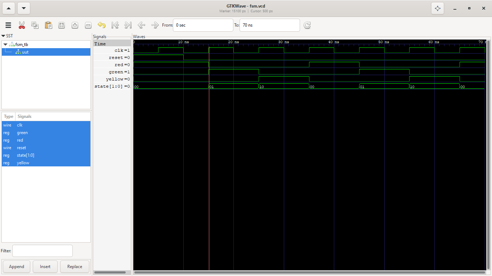

# Traffic Light Controller using FSM

## Overview

This project implements a Traffic Light Controller using a Finite State Machine (FSM) in Verilog HDL. The controller cycles through RED, GREEN, and YELLOW states based on the clock signal.

## Internship Details

**Organization:** CodTech IT Solutions  
**Intern ID:** CITS2417

## Features

- Finite State Machine (FSM)
- Traffic light state transitions
- Clock-driven operation
- Reset functionality

## Tools Used

- Verilog HDL
- Visual Studio Code
- Icarus Verilog
- GTKWave

## Folder Structure

```
src/
tb/
waveforms/
README.md
```

## Simulation

Compile

```bash
iverilog -o traffic_light.out src/traffic_light.v tb/traffic_light_tb.v
```

Run

```bash
vvp traffic_light.out
```

View Waveform

```bash
gtkwave traffic_light.vcd
```

## Simulation Result



## Author

**Rayi Pradeesh**
